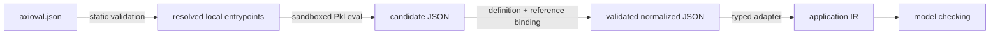

<div align="center">

# Axioval MCS

**Model Checking Specification for vendor-neutral, typed authoring and deterministic interchange.**

[](https://github.com/axioval/mcs/actions/workflows/validate.yml)
[](https://axioval.github.io/mcs/)
[](LICENSE)
[](https://github.com/sponsors/GeneralPawz)

[Documentation](https://axioval.github.io/mcs/) · [Worked DIN 276 example](https://axioval.github.io/mcs/tutorials/din-276-331/) · [Package contract](https://axioval.github.io/mcs/package-contract/) · [Roadmap](ROADMAP.md)

</div>

> [!NOTE]
> Axioval is an **authoring and interchange contract**, not a checking engine. Pkl
> produces candidate data; a validator binds it into deterministic normalized
> JSON; applications lower that data into their own trusted runtime IR.

## What problem does this solve?

Validation requirements mix four concerns that should remain independently reusable:

| Layer | Question | Axioval construct |
| --- | --- | --- |
| Vocabulary | What does “load bearing” mean, and what type is it? | `PropertyDefinition` with `valueKind = "boolean"` |
| External binding | What is a verified concept called in another system? | `ExternalName` only from package-owned or otherwise authenticated identifiers; no free-form IFC template claims |
| Template | What operation can a checker perform? | `RuleDefinition` + typed parameters + stable `capability` |
| Instance | What must be true for which objects? | `RuleInstance` + selector + concrete parameter values |

That separation lets multiple rulesets share terminology and templates without
copying engine logic or tying the interchange format to one checker.

## From vocabulary to a real requirement

The instructional [`examples/din-276-331`](examples/din-276-331/) package models this requirement:

> Objects classified as DIN 276:2018-12 cost group 331 are walls, are load
> bearing, and are external.

Its selector scopes all three rules to objects carrying classification code `331`.
Its reusable vocabulary defines the IFC object type and both boolean properties.
One instance asserts `IfcWall`; two bind a boolean-property template to `true`.
This matters: scoping by `IfcWall` would hide a wrongly typed KG 331 object.

```pkl
["property"] = new Values.PropertyReferenceValue {
  property = "axioval:example.ifc.load-bearing"
  propertySet = "axioval:example.ifc.pset-wall-common"
}
["expected"] = new Values.BooleanValue { value = true }
```

> [!IMPORTANT]
> `propertySet` is an **optional exact-location qualifier**, not a parent folder
> and not part of a property's identity. Omit it to find the canonical property
> in any supported container. Supply it when being in that exact property set is
> itself part of the requirement.

The companion `IsExternal` rule intentionally omits `propertySet`:

```pkl
new Values.PropertyReferenceValue {
  property = "axioval:example.ifc.is-external"
}
```

This is still IFC-aware: an adapter traverses the IFC relationship through the
property set to reach the property. The rule simply declines to treat that
container's name as normative.

[Read the complete tutorial →](https://axioval.github.io/mcs/tutorials/din-276-331/)

## Trust boundary



> [!WARNING]
> Raw Pkl evaluator output is **not** portable normalized data. Registry and
> application implementations must fail closed until manifest validation,
> sandboxing, definition resolution, property-reference binding, parameter
> typing, selector validation, and snapshot verification all succeed.

## Repository layout

```text
schema/                 Pkl contracts, adapters, and static manifest JSON Schema
examples/minimal/       smallest complete non-production package
examples/din-276-331/   vocabulary → template → instance tutorial fixture
examples/geometry-clearance/ IFC4X3 + geometry package integration
docs/                   GitHub Pages source
scripts/                fail-closed evaluator and normalized binder
tests/                  positive and negative contract tests
```

## Specialized OpenBIM contracts

MCS owns rule authoring and normalized transport, not IFC schemas or geometry
kernel vocabularies. `schema/adapters/` accepts version-bound references from
`openbim.ifc` and closed capability IDs from `openbim.geometry`, then lowers
only their stable identifiers into normalized MCS data. The project imports the
published packages as `@ifc` and `@geometry`; `PklProject.deps.json` locks the
resolved metadata checksums for
`package://openbimrs.github.io/pkl/openbim.ifc@0.2.0` and
`package://openbimrs.github.io/pkl/openbim.geometry@0.1.0`. See
[`examples/geometry-clearance`](examples/geometry-clearance/) for an IFC4X3
rule that does not duplicate either package's domain catalog.

<details>
<summary><strong>Run the complete local gate</strong></summary>

Install [Pkl 0.32.1](https://pkl-lang.org/) and run:

```bash
PATH="$HOME/.local/bin:$PATH" ./scripts/check.sh
npx --yes markdownlint-cli2@0.18.1
uvx --with-requirements requirements-docs.txt mkdocs build --strict
```

The first command validates every example manifest, evaluates all declared
entrypoints under the repository boundary, binds the result, compares it to
checked snapshots, and packs and certifies a deterministic temporary MCS file.

To create a transport artifact directly:

```bash
python3 scripts/mcs.py pack examples/minimal /tmp/minimal.mcs --repository-root .
python3 scripts/mcs.py inspect /tmp/minimal.mcs
python3 scripts/mcs.py verify /tmp/minimal.mcs
```

`inspect` checks container structure and embedded hashes without executing Pkl; it
does not authenticate a publisher. `verify` is the authoring-side certification
step; model-checking applications consume only the declarative normalized JSON.

</details>

## Status

The contract is pre-1.0 and deliberately small. Current guarantees, planned
compatibility milestones, and unsupported capabilities are tracked in the
[roadmap](ROADMAP.md) and [changelog](CHANGELOG.md).

## Contributing and governance

- Read [CONTRIBUTING.md](CONTRIBUTING.md) before proposing contract changes.
- Concrete production rulesets belong in independent repositories, not here.
- Axioval-owned and third-party packages receive identical registry treatment.
- Package-specific executable checking logic is never trusted or distributed.

## License

Copyright © Axioval contributors. Licensed under
[GNU Affero General Public License v3.0 or later](LICENSE).
