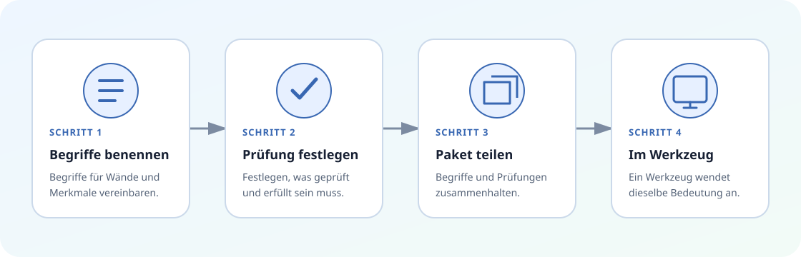

# Gemeinsam beschreiben, wie gut aussieht

Bilderreise: Seite 1 von 3

Zwei Teams können sich über eine Regel einig sein und sie trotzdem unterschiedlich schreiben. Das eine sagt vielleicht „Außenwand“, das andere „externe Wand“. Auch ihre Werkzeuge können dieselbe Information unter unterschiedlichen Namen speichern.

Axioval gibt ihnen eine gemeinsame Beschreibung, die sie weitergeben können.

## Mit einem Satz beginnen

Eine gute Prüfung beginnt mit einem Satz, den Menschen begutachten können:

> Jedes Objekt mit der Kostengruppe 331 muss eine Wand sein, Lasten tragen und außen liegen.

Dieser Satz beantwortet zwei Fragen:

1. **Was sollen wir ansehen?** Mit 331 markierte Objekte.
2. **Was soll zutreffen?** Jedes Objekt ist eine Wand, tragend und außen.

## Sich auf die Wörter einigen

Die Wörter „Wand“, „tragend“ und „außen“ brauchen eine gemeinsame Bedeutung. Mit Axioval kann ein Team jede Idee einmal benennen und sie mit den Namen verbinden, die seine Bauwerkzeuge verwenden.

So muss dieselbe Erklärung nicht in jede Prüfung kopiert werden.

## Die Fragen getrennt halten

Das Beispiel verwendet drei kleine Prüfungen statt einer großen. Das ist wichtig, weil jeder Fehler eine klare Geschichte erzählt:

<ul class="fact-list">
  <li>Das Objekt ist keine Wand</li>
  <li>Tragend trifft nicht zu</li>
  <li>Außen trifft nicht zu</li>
</ul>

Ein Bericht kann auf die genaue Information verweisen, die Aufmerksamkeit braucht.

## Die Beschreibung weitergeben

Die gemeinsamen Namen und Prüfungen reisen zusammen in einem Paket. Ein Werkzeug kann das Paket nur lesen, wenn es die darin enthaltenen Prüfungsarten versteht.

Axioval entscheidet nicht, wie ein Werkzeug ein Gebäudemodell öffnet oder ein Ergebnis darstellt. Es hält die Beschreibung klar, während jedes Werkzeug die Arbeit erledigt, die es beherrscht.

!!! success "Sie kennen jetzt die Grundidee"
    Benennen Sie Dinge klar, beschreiben Sie jede Prüfung in kleinen Teilen und geben Sie die vollständige Beschreibung weiter.

[Die vier Bausteine kennenlernen](building-blocks.de.md){ .md-button .md-button--primary }
