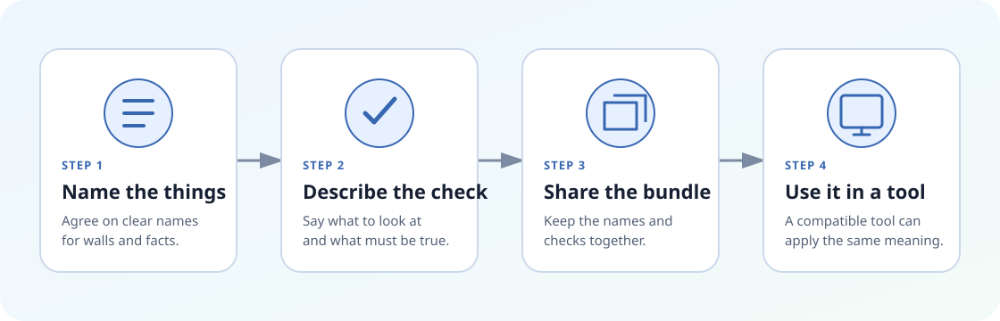
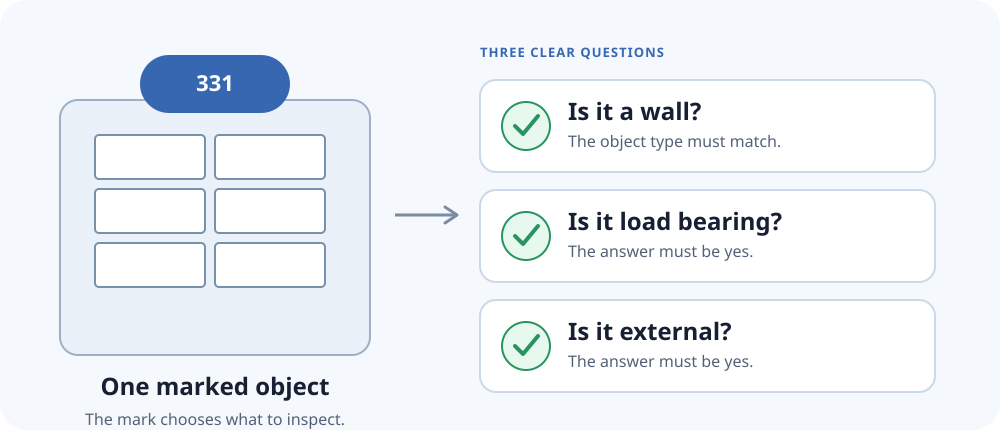

Eine gemeinsame Sprache für Gebäudeprüfungen

# Eine Prüfung einmal schreiben. Sicher weitergeben

Axioval hilft Menschen dabei, zu beschreiben, was in einem Gebäudemodell zutreffen soll. Dieselbe klare Beschreibung kann zwischen Teams und Werkzeugen weitergegeben werden, ohne jedes Mal neu formuliert zu werden.

[Bilderreise beginnen](guide/the-idea.de.md){ .md-button .md-button--primary }
[Ein Wandbeispiel ansehen](tutorials/din-276-331.de.md){ .md-button }

<picture class="responsive-diagram">
  <source media="(max-width: 44rem)" srcset="assets/images/axioval-journey-mobile.svg">
  
</picture>

## Mit einer kurzen Reise beginnen

-   **Seite 1**

    **Die Idee**

    Erfahren Sie, warum gemeinsame Prüfungen Teams dabei helfen, einander zu verstehen.

    [Erste Seite öffnen](guide/the-idea.de.md)

-   **Seite 2**

    **Vier Bausteine**

    Lernen Sie Wörterbuch, Rezept, ausgefüllte Karte und Paket kennen.

    [Zweite Seite öffnen](guide/building-blocks.de.md)

-   **Seite 3**

    **Ein Wandbeispiel**

    Verfolgen Sie eine einfache Prüfung von einer schriftlichen Idee bis zu einem teilbaren Paket.

    [Beispiel öffnen](tutorials/din-276-331.de.md)

-   **Weitergehen**

    **Ein Werkzeug entwickeln oder anbinden**

    Öffnen Sie praktische Anleitungen und ausführliche Referenzseiten, wenn Sie sie benötigen.

    [Anleitungen öffnen](authoring.de.md)

## Was wird einfacher?

<ul class="fact-list">
  <li>Teams verwenden dieselben Namen</li>
  <li>Prüfungen lassen sich leichter begutachten</li>
  <li>Werkzeuge erhalten dieselbe Bedeutung</li>
</ul>

## Ein kleines Beispiel

Stellen Sie sich ein Objekt vor, das mit der Kostengruppe **331** markiert ist. Das Projekt verlangt, dass jedes solche Objekt:

1. eine Wand ist;
2. tragend ist; und
3. außen liegt.

Axioval hält diese drei Fragen getrennt. Ein fehlerhaftes Objekt kann nicht aus der Prüfung verschwinden, nur weil es noch nicht als Wand bezeichnet wird.

<picture class="responsive-diagram">
  <source media="(max-width: 44rem)" srcset="assets/images/wall-check-mobile.svg">
  
</picture>

[Dieses Beispiel Schritt für Schritt ansehen](tutorials/din-276-331.de.md){ .md-button .md-button--primary }

**Sie entwickeln bereits ein Werkzeug?** Auf den [Seiten für Werkzeugentwickler](concepts/layers.de.md) finden Sie genaue Angaben zu Dateien und Sicherheit.

