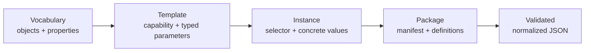

# Axioval Schema

**Define validation meaning once. Reuse it across authoring tools, package registries, and checking engines.**

[Start with the mental model](concepts/layers.md){ .md-button .md-button--primary }
[Work through DIN 276 KG 331](tutorials/din-276-331.md){ .md-button }

!!! note "An interchange contract—not a checking engine"
    Pkl is the typed authoring frontend. Axioval validates and normalizes its
    declarative output. Applications remain responsible for implementing known
    capabilities and adapting normalized data into their trusted runtime IR.

## The journey

-   :material-shape-outline:{ .lg .middle } **Reusable vocabulary**

    ---

    Give object types, properties, and optional container qualifiers stable
    IDs independent of any one file format.

    [Understand the layers →](concepts/layers.md)

-   :material-tune-variant:{ .lg .middle } **Flexible property addressing**

    ---

    Require exact property-set membership only when the requirement values that
    location. Otherwise resolve the property across containers.

    [See strict vs loose references →](concepts/property-addressing.md)

-   :material-file-tree:{ .lg .middle } **Typed templates and instances**

    ---

    Templates declare stable application capabilities and parameter types.
    Instances bind them to selectors and concrete values.

    [Author a package →](authoring.md)

-   :material-shield-check:{ .lg .middle } **Fail-closed normalization**

    ---

    Static manifest inspection precedes sandboxed evaluation; all references and
    values bind before output becomes trusted interchange.

    [Read the package contract →](package-contract.md)

## A concrete example

DIN 276:2018-12 cost group 331 is described as **load-bearing exterior walls**.
The instructional package therefore expresses three independent checks for every
object classified as `331`:

1. its object type is the reusable IFC `IfcWall` concept;
2. `LoadBearing` is `true`, strictly in `Pset_WallCommon`; and
3. `IsExternal` is `true`, with no property-set constraint.

That asymmetry is intentional. IFC stores properties through property-set
relationships, but a validation requirement does not always care what the
container is called.

!!! warning "Instructional, not normative"
    The example demonstrates Axioval's modeling layers. It is not a substitute
    for a licensed copy of DIN 276, project-specific classification rules, or an
    application's documented IFC mapping policy.

[Open the worked example](tutorials/din-276-331.md){ .md-button .md-button--primary }

## Source of truth

- [Pkl schema modules](https://github.com/axioval/schema/tree/main/schema)
- [Checked examples](https://github.com/axioval/schema/tree/main/examples)
- [Normalized contract binder](https://github.com/axioval/schema/blob/main/scripts/contracts.py)
- [Regression tests](https://github.com/axioval/schema/tree/main/tests)
