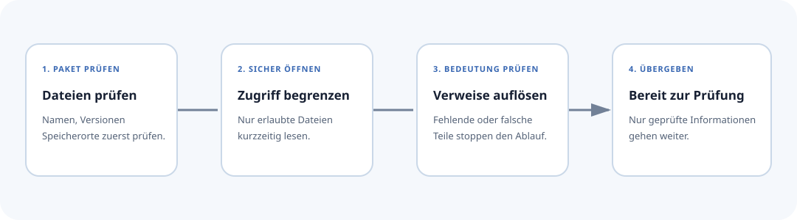

# Sichere Annahme von Paketen

Bevor ein geteiltes Paket ein Prüfwerkzeug erreicht, öffnet Axioval es durch
eine feste Reihe von Sicherheitsstufen. Jede Stufe beantwortet eine einfache
Frage: Sind die Dateien am richtigen Ort, lassen sie sich sicher öffnen, passen
alle Verweise zusammen und ist das Ergebnis vollständig?

Eigene und fremde Pakete durchlaufen dieselben Stufen. Der Name des Repositorys
gibt einem Paket keine Sonderrechte.

<div class="diagram-frame" markdown>



</div>

## Erforderliche Dateien

??? example "Quelltext oder Befehle anzeigen"
    ```text
    axioval.json      # statisches Erkennungsmanifest
    PklProject        # festgelegte Pkl-Projektgrenze
    <entry>.pkl       # von axioval.json benanntes Regelwerkmodul
    <definition>.pkl  # eine oder mehrere von axioval.json benannte Definitionsmodule
    ```

Das Manifest **muss** gegen `schema/registry-manifest.schema.json` validieren. Einstiegspunkte sind repository-relative Pkl-Pfade. Absolute Pfade, `..`-Traversal, unbekannte Felder, fehlende Module und Nicht-Pkl-Einstiegspunkte sind verboten.

## Geordnete Vertrauensgrenze

Die Reihenfolge ist Teil des Sicherheitsvertrags:

1. `axioval.json` als nicht vertrauenswürdige statische Daten parsen;
2. jedes Feld gegen das Manifest-JSON-Schema validieren;
3. **alle** Regelwerk- und Definitionspfade innerhalb der Repository-Wurzel auflösen;
4. Pkl mit lokalen Modulen, Standardbibliothek und prüfsummengebundenen
   Paketmodulen auswerten; HTTPS-Ressourcen sind auf OpenBIM-Paketmetadaten,
   stabile Releases und signierte Release-Asset-Hosts beschränkt. Beliebige
   HTTPS-, Datei- und Umgebungsressourcen bleiben verboten;
5. jedes Kandidaten-Definitionsdokument validieren;
6. deklarierte Pakete, Quellenkataloge, Zitate, Objekttypen, Eigenschaften,
   Property-Set-Qualifizierer, Vorlagen, Anwendbarkeitsgruppen, Anforderungen,
   Selektoren, typisierte Parameterwerte und erklärende Bilddateien binden;
7. doppelte, fehlende, unbekannte, widersprüchliche, fehlerhafte oder nicht unterstützte Deklarationen ablehnen; und
8. semantisch validierte Ausgabe mit geprüften normalisierten Snapshots vergleichen.

!!! danger
    Evaluator-Ausgabe vor Schritt 6 ist **Kandidaten-JSON**, kein normalisiertes Austauschformat. Ein erfolgreicher Pkl-Prozess beweist nicht, dass ein Paket gültig ist.

## Trennung von Autorenerstellung und Laufzeit

Pkl-Quelltext darf Importe, lokale Werte und Hilfen für Autoren verwenden. Die Auswertung muss all dies zu deklarativen Daten absenken. Anwendungen führen nur Fähigkeiten aus, die sie bereits implementieren. Sie führen niemals vom Paket gelieferte Modellprüfungslogik aus.

## Vertrag zur Eigenschaftsauflösung

Eine Eigenschaftsreferenz benennt immer eine kanonische `PropertyDefinition`.

- Ohne `propertySet` lösen Adapter sie über unterstützte Container hinweg auf.
- Mit `propertySet` verlangen Adapter genau diese kanonische Containerbeziehung.
- Mehrere inkompatible Auflösungen sind Konflikte, keine beliebigen Gewinner.
- `referencedValueKind` muss mit der referenzierten Eigenschaftsdefinition übereinstimmen.

Property-Set-Qualifizierer besitzen keine Eigenschaften und sind keine Ausführungsordner.

## Selektorwerte als Parameter

Eine Fähigkeit mit einem zweiten Objektbereich deklariert einen Parameter mit
`kind = "selector"`. Die Regel bindet über
`SelectorValues.SelectorValue` einen vollständigen Selektor. Sie darf den
Bereich nicht auf einen rohen Typnamen oder einen ausführbaren Rückruf
reduzieren.

??? example "Selektorwertigen Parameter anzeigen"
    ```pkl
    import "Selectors.pkl"
    import "SelectorValues.pkl"

    parameters {
      ["compared"] = new SelectorValues.SelectorValue {
        value = new Selectors.AllOfSelector {
          operands {
            new Selectors.EntityTypeSelector {
              objectType = "axioval:example.ifc.wall"
            }
          }
        }
      }
    }
    ```

Der normalisierte Wert hat `type: "selector"` und enthält ein
Selektorobjekt. Der Binder prüft dieses Objekt rekursiv und löst alle Objekt-
typen und Eigenschaftskonzepte über die geladenen Definitionspakete auf.
Unbekannte Konzepte, fehlerhafte Operanden und nicht unterstützte
Wertkombinationen werden geschlossen abgelehnt.

## Vertrag für Quellenangaben

Jedes Regelsatz- und Definitionsdokument deklariert einen eigenen
Quellenkatalog. Zitate müssen innerhalb dieses Katalogs aufgelöst werden.
Definitionskomponenten, Regeln und Anforderungen dürfen Quellen direkt zitieren.
`parameterCitations` muss nicht leere, eindeutige Parameter-IDs nennen, die
dieselbe Regel tatsächlich bindet. Zitat-IDs sind innerhalb ihrer Regel oder
Definitionskomponente eindeutig. Doppelte Fundstellen werden abgelehnt.

Quellen-URLs sind optional. Wenn sie vorhanden sind, müssen sie absolute
HTTPS-URLs ohne eingebettete Zugangsdaten sein. Veröffentlichungsdaten verwenden
gültige ISO-Formen `YYYY`, `YYYY-MM` oder `YYYY-MM-DD`. Lokalisierte Quellentitel
und Hinweise folgen demselben geschlossen geprüften Lokalisierungsvertrag wie
Regeltexte.

Ein Zitat dokumentiert ausschließlich die Herkunft. Es darf Selektoren,
Anforderungen, Nachweise, Ergebnisse, Rechtsstatus oder Konformitätsaussagen
niemals verändern. Speichern Sie bibliografische Metadaten und genaue
Fundstellen, nicht urheberrechtlich geschützten Normentext.

## Bilddateien im Paket

Erklärende Bilder sind Daten und keine ausführbaren Erweiterungen. Ihre Pfade
müssen im Paket bleiben. Aufrufer müssen bei Regelsätzen mit Bildreferenzen die
Paketwurzel übergeben; ohne sie lehnt der Binder solche Regelsätze ab. Er löst
jede referenzierte Datei auf, prüft Größe, Erweiterung, deklarierten Medientyp
und Dateisignatur und parst SVG als inertes XML. Aktive Elemente,
Ereignisbehandler, externe Links, Dokumenttypen, Verarbeitungsanweisungen,
Stilinhalte und fremde SVG-Inhalte werden geschlossen abgelehnt. Verbraucher
sollen dennoch eine eigene Sandbox für Bilddekodierung und Darstellung
verwenden.

## Quell- und kompilierte Formen

Pkl-Quelltext ist für die Bearbeitung maßgeblich. Eine Registry kann validiertes normalisiertes JSON zwischenspeichern, aber generierte Ausgabe allein beweist nicht, dass die Quelle sicher oder gültig ist. Cache-Schlüssel sollen die unveränderliche Quellrevision, Schemaversion, Pkl-Version und Validator-Version enthalten.

## Lizenzierung und Herkunft

Paketautoren wählen ihre eigene Lizenz und ihren Repository-Host. Eine Registry-Auflistung überträgt kein Eigentum und bedeutet keine Befürwortung. Axioval-eigene Pakete sind gewöhnliche Pakete, die durch dieselbe Pipeline validiert werden.
