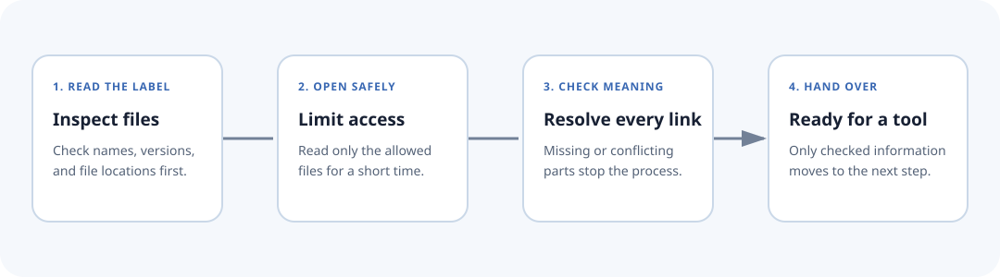

# Safe package acceptance

Before a shared bundle reaches a checking tool, Axioval opens it through a fixed
series of safety gates. Each gate answers one plain question: are the files where
they should be, can they be opened safely, do all references make sense, and does
the result match the reviewed snapshot?

Every package follows the same path. A package owned by Axioval receives no extra
permissions or trust.

<div class="diagram-frame" markdown>



</div>

## Required files

??? example "Show the required files"
    ```text
    axioval.json      # static discovery manifest
    PklProject        # pinned Pkl project boundary
    <entry>.pkl       # ruleset module named by axioval.json
    <definition>.pkl  # definition modules named by axioval.json
    ```

The manifest **must** validate against
`schema/registry-manifest.schema.json`. Entrypoints are repository-relative Pkl
paths. Absolute paths, `..` traversal, unknown fields, missing modules, and
non-Pkl entrypoints are forbidden.

## Ordered trust boundary

The order is part of the security contract:

1. parse `axioval.json` as untrusted static data;
2. validate every field against the manifest JSON Schema;
3. resolve **all** ruleset and definition paths inside the repository root;
4. evaluate Pkl with only `file:`/`pkl:` modules and `file:`/`prop:` resources,
   under CPU, memory, output, and time limits;
5. validate every candidate definition document;
6. bind declared packages, object types, properties, property-set qualifiers,
   templates, applicability groups, requirements, selectors, typed parameter
   values, and explanatory image assets;
7. reject duplicate, missing, unknown, conflicting, malformed, or unsupported
   declarations; and
8. compare semantically validated output with checked normalized snapshots.

!!! danger
    Evaluator output before step 6 is **candidate JSON**, not normalized
    interchange. A successful Pkl process is not proof of a valid package.

## Authoring and runtime separation

Pkl source may use imports, local values, and authoring helpers. Evaluation must
lower all of that to declarative data. Applications execute only capabilities
they already implement; they never execute package-supplied model-checking code.

## Property-resolution contract

A property reference always names a canonical `PropertyDefinition`.

- With no `propertySet`, adapters resolve it across supported containers.
- With `propertySet`, adapters require that exact canonical container relation.
- Multiple incompatible resolutions are conflicts, not arbitrary winners.
- `referencedValueKind` must agree with the referenced property definition.

Property-set qualifiers do not own properties and are not execution folders.

## Selector-valued parameters

A capability that needs a second object scope declares a parameter with
`kind = "selector"`. The rule binds a complete selector using
`SelectorValues.SelectorValue`; it must not reduce the scope to a raw type name
or an executable callback.

??? example "Show a selector-valued parameter"
    ```pkl
    import "Selectors.pkl"
    import "SelectorValues.pkl"

    parameters {
      ["compared"] = new SelectorValues.SelectorValue {
        value = new Selectors.AllOfSelector {
          operands {
            new Selectors.EntityTypeSelector {
              objectType = "axioval:example.ifc.wall"
            }
          }
        }
      }
    }
    ```

The normalized value has `type: "selector"` and a nested selector object. The
binder recursively validates that object and resolves every object-type and
property concept through the loaded definition packages. Unknown concepts,
malformed operands, and unsupported value combinations fail closed.

## Package image assets

Explanatory images are data, not executable extensions. Their paths must remain
inside the package. Callers must provide the package root whenever a ruleset
references images; the binder rejects image-bearing rulesets when that root is
missing. It resolves every referenced file, checks the size, extension, declared
media type, and file signature, and parses SVG as inert XML. Active elements,
event handlers, external links, document types, processing instructions, style
content, and foreign SVG content fail closed. Consumers should still apply their
own image decoding and rendering sandbox.

## Source and compiled forms

Pkl source is authoritative for editing. A registry may cache validated
normalized JSON, but generated output alone is not proof that source is safe or
valid. Cache keys should include the immutable source revision, schema version,
Pkl version, and validator version.

## Licensing and provenance

Package authors choose their own license and repository host. Registry listing
does not transfer ownership or imply endorsement. Axioval-owned packages are
ordinary packages validated through the same pipeline.
