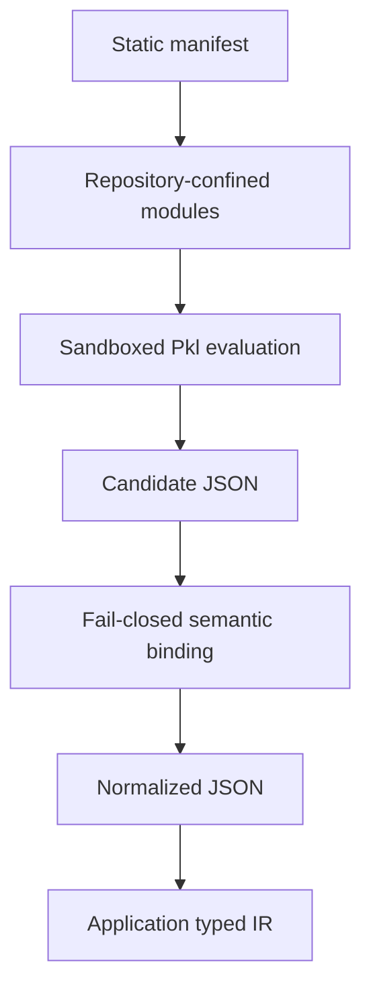

# Ruleset repository contract

A registry submission represents a package—not a privileged publication
channel. Axioval-owned and third-party repositories follow the same contract and
receive no extra capabilities or trust.

## Required files

```text
axioval.json      # static discovery manifest
PklProject        # pinned Pkl project boundary
<entry>.pkl       # ruleset module named by axioval.json
<definition>.pkl  # one or more definition modules named by axioval.json
```

The manifest **must** validate against
`schema/registry-manifest.schema.json`. Entrypoints are repository-relative Pkl
paths. Absolute paths, `..` traversal, unknown fields, missing modules, and
non-Pkl entrypoints are forbidden.

## Ordered trust boundary

The order is part of the security contract:

1. parse `axioval.json` as untrusted static data;
2. validate every field against the manifest JSON Schema;
3. resolve **all** ruleset and definition paths inside the repository root;
4. evaluate Pkl with only `file:`/`pkl:` modules and `file:`/`prop:` resources,
   under CPU, memory, output, and time limits;
5. validate every candidate definition document;
6. bind declared packages, object types, properties, property-set qualifiers,
   templates, selectors, and typed parameter values;
7. reject duplicate, missing, unknown, conflicting, malformed, or unsupported
   declarations; and
8. compare semantically validated output with checked normalized snapshots.

!!! danger
    Evaluator output before step 6 is **candidate JSON**, not normalized
    interchange. A successful Pkl process is not proof of a valid package.

## Authoring and runtime separation

Pkl source may use imports, local values, and authoring helpers. Evaluation must
lower all of that to declarative data. Applications execute only capabilities
they already implement; they never execute package-supplied model-checking code.



## Property-resolution contract

A property reference always names a canonical `PropertyDefinition`.

- With no `propertySet`, adapters resolve it across supported containers.
- With `propertySet`, adapters require that exact canonical container relation.
- Multiple incompatible resolutions are conflicts, not arbitrary winners.
- `referencedValueKind` must agree with the referenced property definition.

Property-set qualifiers do not own properties and are not execution folders.

## Source and compiled forms

Pkl source is authoritative for editing. A registry may cache validated
normalized JSON, but generated output alone is not proof that source is safe or
valid. Cache keys should include the immutable source revision, schema version,
Pkl version, and validator version.

## Licensing and provenance

Package authors choose their own license and repository host. Registry listing
does not transfer ownership or imply endorsement. Axioval-owned packages are
ordinary packages validated through the same pipeline.
